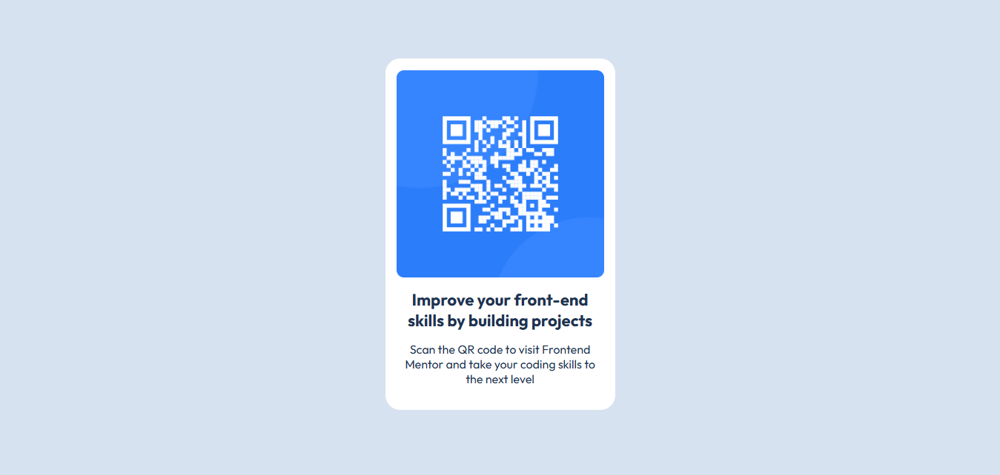

# Frontend Mentor - QR code component solution

This is a solution to the [QR code component challenge on Frontend Mentor](https://www.frontendmentor.io/challenges/qr-code-component-iux_sIO_H). Frontend Mentor challenges help you improve your coding skills by building realistic projects. 

## Table of contents

- [Overview](#overview)
  - [Screenshot](#screenshot)
- [My process](#my-process)
  - [Built with](#built-with)
  - [What I learned](#what-i-learned)
  - [Continued development](#continued-development)
  - [Useful resources](#useful-resources)
- [Author](#author)

## Overview

### Screenshot

## My process

### Built with

- Semantic HTML5 markup
- Flexbox
- Mobile-first workflow

### What I learned

I learned Flexbox, how can I have a responsive design, and learned about the nth child of a class.

### Continued development

I struggle sometimes how to use flexbox, and I think I need to focus more on that.

### Useful resources

- [CSS Flexbox Layout Guide](https://css-tricks.com/snippets/css/a-guide-to-flexbox/) - This helped me all about flexbox.
- [HTML Tutorial](https://www.w3schools.com/html/) - This helped me learned about semantic HTML, nth child of a class.

## Author

- Facebook - [Ramcez James Fat](https://www.facebook.com/zecmarsemaj)
- Frontend Mentor - [@ramisys](https://www.frontendmentor.io/profile/ramisys)